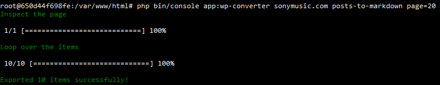

# WordPress Converter
## Synfony 5 Command application.
WordPress Converter allows you to convert WordPress posts to markdown pages using WordPress API.

### Installation
```
git clone https://github.com/gmaccario/wordpress-converter.git wordpress-converter
cd wordpress-converter
docker-compose up -d
docker exec -it wordpress-converter-php /bin/bash
composer install
```

### WordPress Converter Commands
* php bin/console app:wp-converter example.com posts-to-markdown
* php bin/console app:wp-converter example.com posts-to-markdown page=20

### Folder markdown
* /var/markdown/example.com

### Screenshot


### Symfony Commands
* php bin/console --version
* php bin/console about
* php bin/console cache:clear
* php bin/console debug:autowiring

### PHPUNIT
* php bin/phpunit
* php bin/phpunit tests/Command/WPExportPostsToMarkdownCommandTest
* php bin/phpunit tests/Service/DataProviderTest

### WordPress Domain list example
* sonymusic.com
* bbcamerica.com
* rollingstones.com
* cooperhewitt.org
* cure.org
* sites.lsa.umich.edu

### WordPress endpoints
* /wp-json/wp/v2/posts
* /wp-json/wp/v2/pages
* https://developer.wordpress.org/rest-api/reference/
* https://developer.wordpress.org/rest-api/reference/posts/
* https://developer.wordpress.org/rest-api/using-the-rest-api/pagination/
* https://developer.wordpress.org/rest-api/using-the-rest-api/authentication/

* https://www.unsitoweb.it/indecisi-eccovi-una-lista-di-siti-creati-con-wordpress.html
* https://www.wired.it/wp-json/wp/v2/posts?page=1
* https://dillinger.io/

### Todo
* Store on db
* Extend conversion (not only markdown)
* In services.yml, switch public to false (true now)

### Change log
#### 20200516
* Check header: no wp-total-posts, no WordPress
* Fixed  SSL connect error
* Input arguments: type of conversion, domain, page
* Fixed Invalid URL: no "base_uri"
